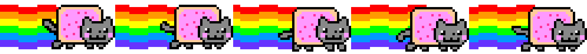
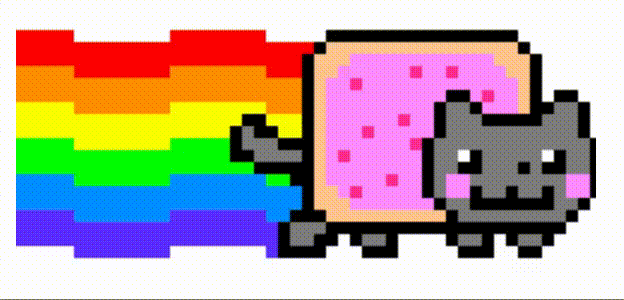
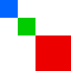
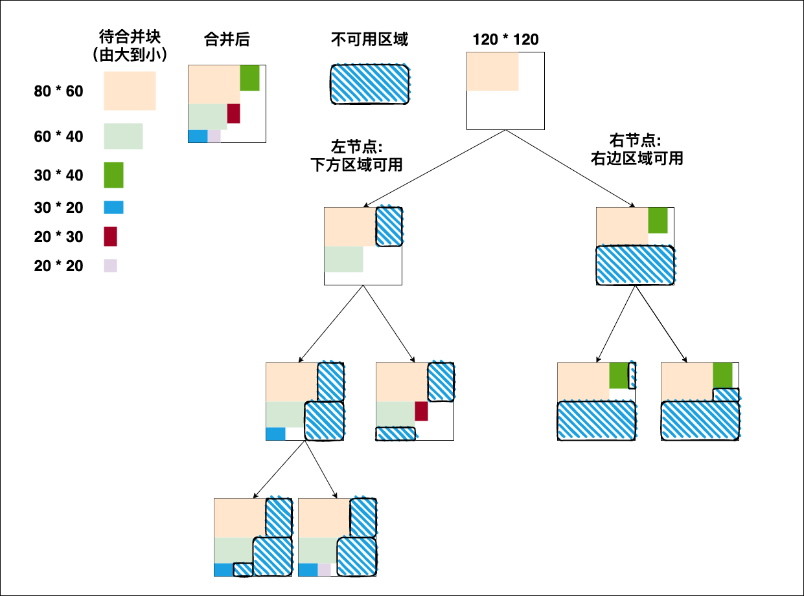

# Sprite揭秘

## 简介

精灵图（英语：[Sprite](https://terms.naer.edu.tw/detail/3268800/)），又被称为雪碧图或拼合图。在计算机图形学中，当一张二维图像集成进场景中，成为整个显示图像的一部分时，这张图就称为精灵图。

常见碳酸饮料雪碧的英文名也是 `Sprite`，因此也有人会使用雪碧图的非正式译名。

精灵图起源于街机游戏，当时的意思是独立于背景的独立移动的二维图被称为 Sprite，那时候的游戏还没有 GPU 来渲染，而是通过电路，显像管等硬件在显示器逐行扫描实现的，所以这些跟背景分离的图像就跟浮起来一样，所以叫精灵（Sprite）。

这个概念影响之后许多游戏引擎和整个前端行业，例如使用`JavaScript`的游戏引擎：Egret中的`SpriteSheet`、Cocos Creator中的`Sprite Frame`。前端开发中常见的`CSS Image Sprites`，使用`background-position`从一张精灵图上渲染不同的icon，还可以配合`keyframes`制作动画。

在前端性能优化的时候，其中图片优化最有效也是频率最高的就是CSS精灵图，把多张图片融合成一张图片，然后通过css `background-position`取指定位置的图片，减少了http请求次数自然减少了加载时间。

## 简单动画

下面来简单的看一下如何使用精灵图配合`keyframes`制作简单的动画




```html
<style>
.cat {
    width: 292px;
    height: 148px;
    background: url(./cat.png);
    animation-name: run;
    animation-duration: .5s;
    animation-timing-function: steps(5);
    animation-iteration-count: infinite;
}

@keyframes run {
    from {
        background-position-x: 0;
    }

    to {
        background-position-x: -1494px;
    }
}
</style>
<body>
    <div class="cat"></div>
</body>
```

## 前端应用

在前端开发还处于刀耕火种的年代，拼合一张精灵图是通过PhotoShop，将一堆图标放到一张图里，这样使用精灵图虽然优化了性能，但是苦了开发，当几百张小图合并在一张图之后，想要修改其中的一张，就要让UI重新出图，不改图片尺寸还好，改了尺寸修改`position`的工作量非常大。

进入到现在前端开发更加工程化、自动化的时代，就有了很多解放生产力的工具，比如我们可以通过[webpack-spritesmith](https://github.com/mixtur/webpack-spritesmith)，配合webpack就可以将一堆零散的图片打包到一张图片当中，并且还可以自动生成相关的css数据。


## 实现

如何将这些小图片拼合在一张大图上：

- 
  > 从左到右直接拼接起来

- 
   > 从上到下拼接起来

- 
   > 沿着对角线拼接起来

- 
   > 充分利用空间把它们拼接起来

很明显前三种的空间利用率都很低，最后会导致生成的图片尺寸非常的大，并且非常宽或高的图像不是很人性化，需要缩放和平移。

这里要分享的就是第四种二叉树的方式进行打包，这是将物品装入尽可能小的容器中的有效方法。

---
先来看一下如何将一些小图放到一个指定的大小的空间里，如图所示：

这里将依次把`(宽度 * 高度)`为：

1. `80 * 60`
1. `60 * 40`
1. `30 * 40`
1. `30 * 20`
1. `20 * 30`
1. `20 * 20`

的色块放入到`120 * 120`的容器中去。




左节点定义为**下方有可用区域**

右节点定义为**右边有可用区域**

1. 在左上角放置最大的1号`80 * 60`色块
> 容器被分为一级左节点（下方可用 `80 * 60`） 和 一级右节点 （右边可用 `40 * 120`）

2. 继续插入2号`60 * 40`色块，左节点可以放下色块，直接在左节点的左上角放入色块
> 一级左节点被分为二级左节点1（下方可用`60 * 20`）和 二级右节点2（右边可用`20 * 60`）

3. 继续插入3号`30 * 40`色块，二级左右节点均无法插入
   
4. 返回一级右节点，可以插入，放在右侧可用区域左上角
> 一级右节点被分为二级左节点3（下方可用`30 * 20`）和 二级右节点4（右边可用`10 * 60`）

5. 继续插入4号`30 * 20`色块，二级左节点1（下方可用`60 * 20`）可以插入
> 下方没有剩余空间了，三级左节点不可用，三级右节点（右边可用`30 * 20`）

6. 依此类推，将所有色块插入 ...


完成以上搜索插入的步骤之后就可以得到一颗带有色块布局信息的二叉树。